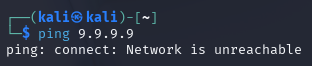
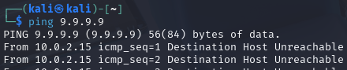
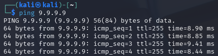
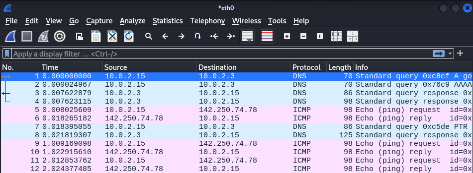
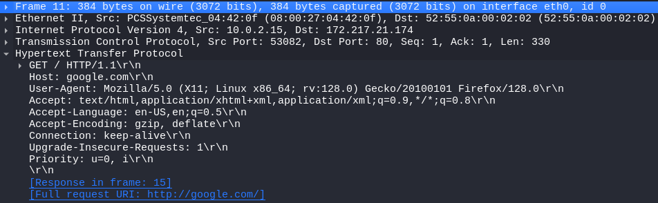
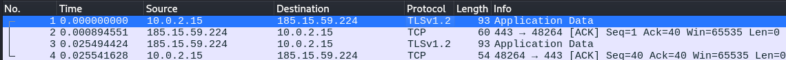
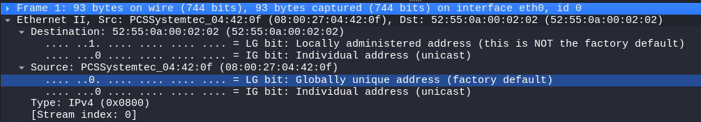
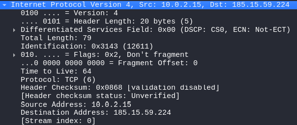
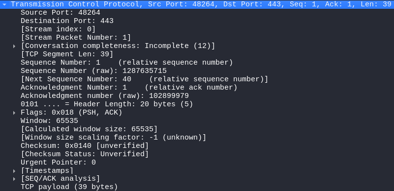
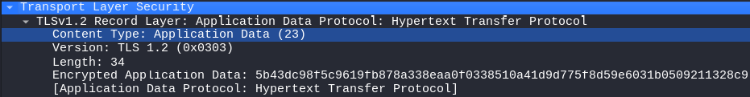

# Homework 1

Homework report for [h1 Sniff](https://terokarvinen.com/verkkoon-tunkeutuminen-ja-tiedustelu/#h1-sniff) [[1]](#bibliography)

## Table of Contents

- [Introduction](#1-introduction)
- [x. Read and summarize](#x-read-and-summarize)
- [a. Linux](#a-linux)
- [b. Can't fish](#b-cant-fish)
- [c. Wireshark](#c-wireshark)
- [d. Really TCP/IP](#d-really-tcpip)
- [e. What did I surf?](#e-what-did-i-surf)
- [f. (Optional) What browser is the user using?](#f-optional-what-browser-is-the-user-using)
- [g. What model is the network card?](#g-what-model-is-the-network-card)
- [f. What web server has the user surfed at?](#h-what-web-server-has-the-user-surfed-at)
- [i. Analysis](#i-analysis)
- [Bibliography](#bibliography)

## Introduction

In today's homework, I configure my environment and get a little familiar with sniffing packets in Wireshark.

## x. Read and Summarize

### Wireshark

Wireshark is a network sniffer and analyzer [[2]](#bibliography). It can be used to capture traffic on network interfaces, which can then be analyzed in more detail. Packet captures can be saved as pcap-files, saving them for later analysis. Packets can be filtered in various ways to make finding them in the list easier. 

### Network Interface Names on Linux

These days, network interfaces on Linux use a naming scheme by systemd [[3]](#bibliography). Instead of 'eth', wired ethernet interfaces use the prefix 'en' (eg. enp1s0). WLAN, instead of 'wlan', use 'wl' now (eg. wlp4s0). The abbreviation 'lo' refers to the loopback address. You can check your interfaces with the command ``ip a``. 

The Kali Linux I will be using still uses the old naming scheme.

## a. Linux

I downloaded a pre-built VirtualBox machine image with Kali Linux from [kali.org](https://www.kali.org/get-kali/#kali-virtual-machines) [[4]](#bibliography), ran it, and changed the default password.

I will use this virtual machine for the remainder of this homework, unless otherwise stated.

## b. Can't fish

I can disconnect the eth0 interface inside Kali Linux. Pinging will now result in the following error:

I can also cut the connection by going in to VirtualBox settings, and selecting 'None' in the dropdown menu of Network Adapter 1. This will result in the following error when pinging inside Kali Linux:

Restoring the connection will result in the following:

## c. Wireshark

Conveniently, Kali Linux has Wireshark already installed. I launched Wireshark, then made a ping google.com to confirm that it's capturing traffic.

## d. Really TCP/IP

In the above image is a packet I captured in Wireshark when browsing to 'google.com' in Firefox. There are five entries. The first two are the link layer in the TCP/IP-model. The second specifically, shows the MAC addresses in the frame. The third is the internet layer, and shows the IP-address of my Linux virtual machine (10.0.2.15), as well as the IP-address of the Google server. The fourth is the transport layer and shows information on the TCP segment. The last entry shows the application layer, which in this case shows information on the HTTP PDU.

## e. What did I surf?

I downloaded the surfing-secure.pcap file provided in the assignment and opened it with Wireshark. The traffic consists mostly of encrypted communications using TLSv1.3. The start also contains some packets using QUIC. Other protocols that can be observed in the traffic are DNS, TCP, and ARP.

Using Wireshark's IPv4 analysis, I can see there are seven different hosts. The host capturing the traffic and initiating the connections is 192.168.122.7, as it's found in 100% of the captured packets. Over half of the traffic happened with the host 139.162.131.217. The DNS queries reveal that IP-address belongs to the domain terokarvinen.com. Typing that address into Firefox takes me to app.terokarvinen.com.

The following seems to indicate that the host communicated with a server in terokarvinen.com, and that it was secured. Any more specifically I cannot tell with my current limited skills in sniffing.

## f. (Optional) What browser is the user using?

I will skip this optional question, for now.

## g. What model is the network card?

There are two MAC addresses, but both are locally administered, meaning they are not the original hardware addresses. Therefore, I cannot determine the make of the network card based on the MAC address.

Currently, I don't know of another way to find out who made the network card.

## h. What web-server has the user surfed at?

As mentioned previously, the host 139.162.131.217 seems to belong to a server in terokarvinen.com.

## i. Analysis

I used Wireshark to capture a couple of packets when I connected to example.com in Firefox. I will attempt to analyze and explain what's happening to the best of my abilities.

The four captured frames are communication happening between my Linux machine (10.0.2.15) and the server of example.com (185.15.59.224). Frames 1 and 3 contain application layer data that's being encrypted using TLSv1.2 (Transport Layer Security). Frames 2 and 4 contain transport layer data using TCP (Transmission Control Protocol). The ACK refers to acknowledgment that the receiver makes to tell the data has been received [[5]](#bibliography).

Looking more closely at the first frame, we can see the link layer information. We can see that frame is 93 bytes, and was transferred on interface eth0, which is the network interface on my Linux virtual machine. It has the MAC address of 08:00:27:04:42:0f, which lookes like a real hardware address, but I suspect is given by Kali Linux to the interface to seem real. The destination address is not a hardware address, and most likely belongs VirtualBox, which is acting as a router.

Next we can see information on the internet layer, which again shows the source and destination IP-addresses. The addresses and version number indicate that it's using IPv4.

On the transport layer, we can see the data is sent to port 443 , which is commonly used by HTTPS [[4]](#bibliography). There is also a bunch of other info about the TCP segment, which I don't understand.

Finally is the application layer, which contains the actual data shown by my browser, that's been encrypted using TLS. The TLS version being used is 1.2. The application data is 34 bytes long. The 'encrypted application data' field shows the actual data in hexadecimal. We can also see that TLS is working on top of HTTP.

## Bibliography

[1]
T. Karvinen, “h1 Sniff - Verkkoon Tunkeutuminen Ja Tiedustelu - Network Attacks and Reconnaissance,” Terokarvinen.com, 2025. https://terokarvinen.com/verkkoon-tunkeutuminen-ja-tiedustelu/#h1-sniff (accessed Apr. 01, 2025).

[2]
T. Karvinen, “Wireshark - Getting Started,” Terokarvinen.com, 2025. https://terokarvinen.com/wireshark-getting-started/ (accessed Apr. 01, 2025).

[3]
T. Karvinen, “Network Interface Names on Linux - wlp4s0 lo enp1s0,” Terokarvinen.com, 2025. https://terokarvinen.com/network-interface-linux/ (accessed Apr. 01, 2025).

[4]
OffSec Services Limited, “Get Kali,” Kali Linux, 2025. https://www.kali.org/get-kali/#kali-virtual-machines (accessed Apr. 02, 2025).

[5]
Wikipedia Contributors, “Transport Layer Security,” Wikipedia, Mar. 26, 2019. https://en.wikipedia.org/wiki/Transport_Layer_Security (accessed Apr. 02, 2025).

[6]
Wikipedia Contributors, “Internet Protocol Suite,” Wikipedia, Mar. 25, 2019. https://en.wikipedia.org/wiki/Internet_Protocol_Suite (accessed Apr. 02, 2025).