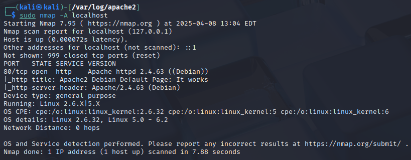
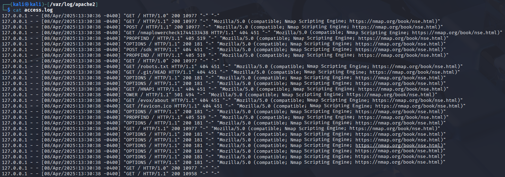
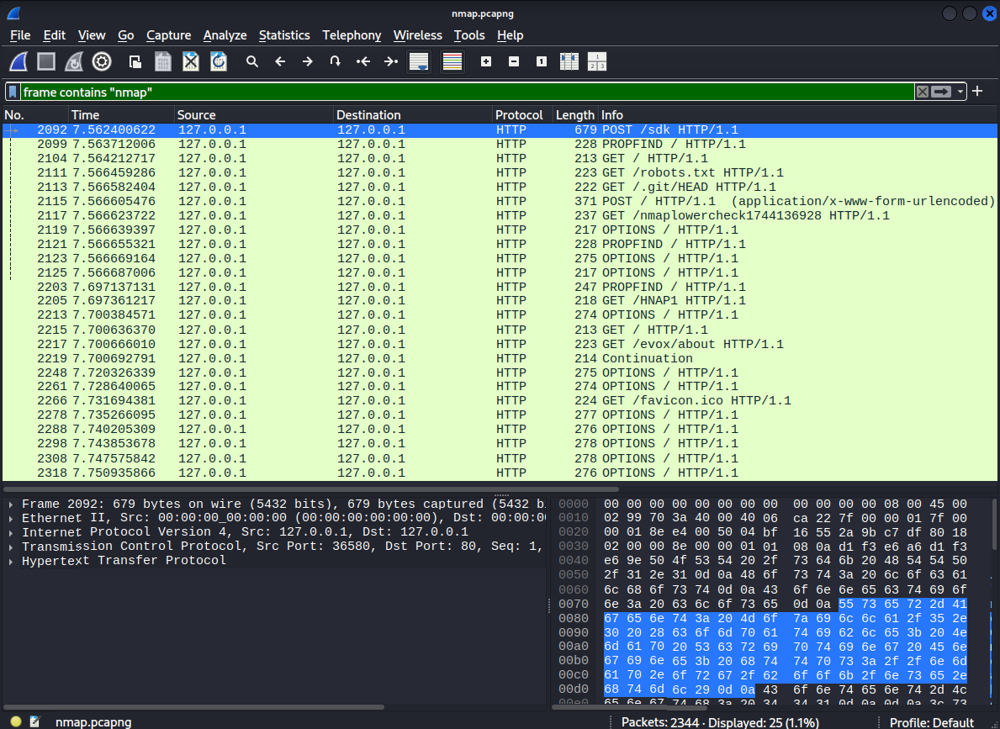
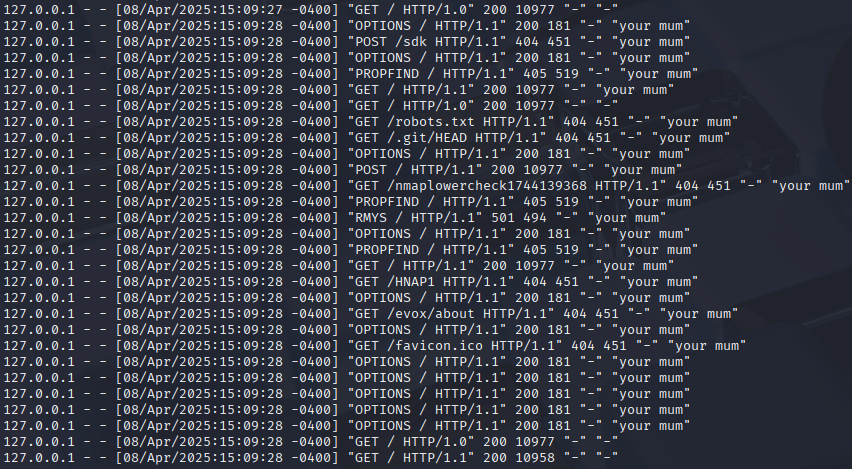
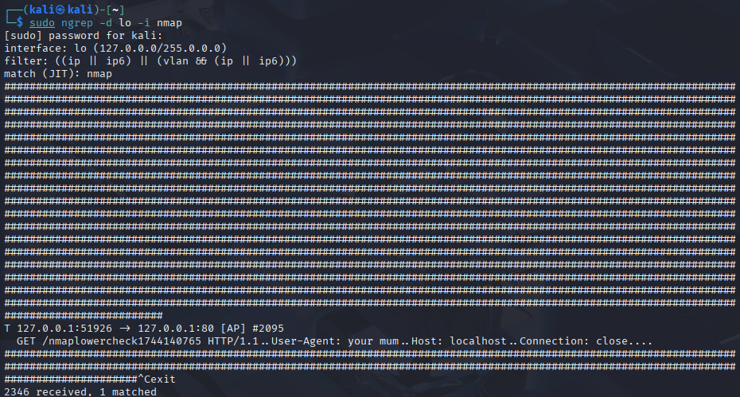
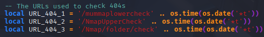
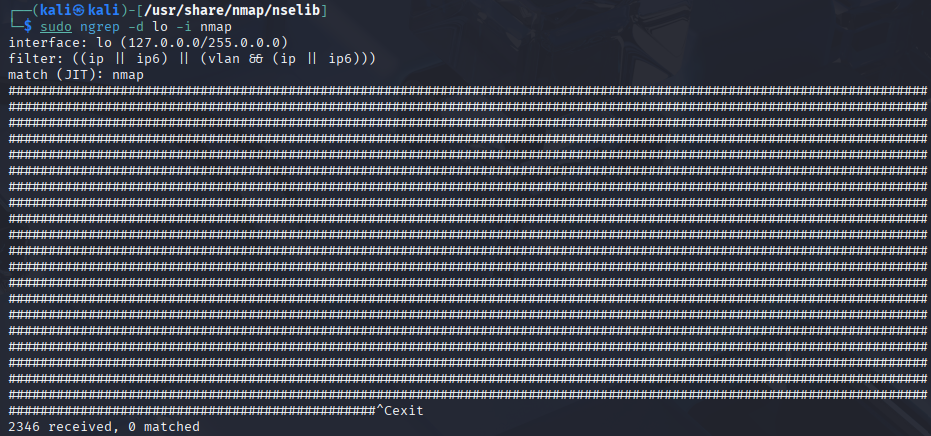

# Homework

Homework report for [h1 favorite color: violet](https://terokarvinen.com/verkkoon-tunkeutuminen-ja-tiedustelu/#h2-lempivari-violetti) [[1]](#bibliography)

## Table of Contents

- [1. Introduction](#1-introduction)
- [x. Read and answer questions in short](#x-read-and-answer-questions-in-short)
- [a. Apache log](#a-apache-log)
- [b. Nmapped](#b-nmapped)
- [c. Scripts](#c-scripts)
- [d. Traces in the logs](#d-traces-in-the-logs)
- [e. Wiresharking](#e-wiresharking)
- [f. Net grep](#f-net-grep)
- [g. Agent && h. Smaller traces](#g-agent--h-smaller-traces)
- [i. LoWeR ChEcK](#i-lower-check)
- [Bibliography](#bibliography)

## Introduction

I'll be learning about port scanning with Nmap, as well as about a potential way to hide the scan from the target machine.

Unless otherwise stated in an exercise, I'm using a Kali Linux virtual machine, with VirtualBox being the hypervisor.

## x. Read and answer questions in short

The Pyramid of Pain is a concept by David Bianco [[2]](#bibliography). It categorizes different indicators of adversarial action into levels that correspond with how much hardship or "pain" you can cause the attacker with those indicators. The easiest to gather indicators are hash values, but having them won't give you much of an edge. In contrast, knowing which tools the attacker uses gives you much more power to defend against them.

The Diamond Model of Intrusion Analysis [[3]](#bibliography) is used to break down cyber intrusion events into their four core features - adversary, capability, infrastructure, and victim - in order to systematically analyze the events and further understanding of the threat. The basic idea is that "for every intrusion event there exists an adversary taking a step towards an intended goal by using a capability over infrastructure against a victim to produce a result."

## a. Apache log

Apache2 was already installed on the virtual machine, so I started with updating it along with all other packages.

I launched the Apache2 server with ``sudo systemctl start apache2``. I then opened Firefox and connected to ``http://localhost``, which opened the default web page. After that I looked at the Apache2 logs in ``/var/log/apache2/access.log``. Below is the first line, which shows that I connected to the web server.

```
127.0.0.1 - - [08/Apr/2025:10:38:48 -0400] "GET / HTTP/1.1" 200 3383 "-" "Mozilla/5.0 (X11; Linux x86_64; rv:128.0) Gecko/20100101 Firefox/128.0"
```

I checked Apache documentation [[4]](#bibliography) to get a better understanding of how to read the logs.

First is the IP-address (``127.0.0.1``) of the client that made the request to the server. In this case it's the loopback address, because the server and client were on the same machine. The hyphens are missing information about the identity of the client, because that information wasn't collected. Then there's the detailed timestamp of the request. After the timestamp is ``GET``, which is the method. The ``/`` is the requested resource - in this case, the root. ``HTTP/1.1`` tells the protocol and version of the protocol. The ``200`` is the status code the server sent back to the client - in this case, a successful response. ``3383`` is the size of the object returned to the client, not including the response headers. The ``"-"`` is the "referer", aka where was the client referred from. It's empty, because I didn't use a link to get to the site. The last part ``"Mozilla/5.0 (X11; Linux x86_64; rv:128.0) Gecko/20100101 Firefox/128.0"`` is the User-Agent HTTP request header, which details information on the client's browser. Here it shows that I used Firefox on a Linux machine.

## b. Nmapped

Before scanning any ports I disconnected the VirtualBox network adapter, so I don't accidentally do anything illegal.

I then ran the command ``sudo nmap -A localhost`` to initiate port scanning with Nmap on my virtual machine.



From the results we can see that only port 80 is open. We can also see that the service running on the port is our Apache server.

## c. Scripts

In the previous output image from Nmap, we can see that the scripts that were used in scanning port 80 were ``http-title`` and ``http-server-header``.

## d. Traces in the logs

I made a backup of ``/var/log/apache2/access.log`` and deleted the original to see what the logs look like with just the port scan. Then I ran Nmap again as previously.



In the part for the User-Agent HTTP request header, instead of information about the browser, we can see that "Nmap Scripting Engine" was used. 

If the logs were much larger and more difficult to browse through, I could use ``cat access.log | grep nmap`` to highlight all the lines with "nmap" in them. Searching for "Nmap" would also produce hits.

According to the logs, scanning with Nmap used GET, POST, PROPFIND, OPTIONS, and OWER methods. The GET method was used to try to request resources from various directories, like ``/sdk`` and ``/robots.txt``, but failed, because they didn't exist. PROPFIND and OWER were not familiar to me. Apparently PROPFIND "retrieves properties defined on the resource identified by the Request-URI" [[5]](#bibliography). I could not find what the OWER method is.

## e. Wiresharking

I captured the network traffic at the loopback address while port scanning with Nmap. 

There were 2344 frames captured in total, but - filtering with ``frame contains "nmap"`` - only 25 of them contain the string "nmap". The frames containing "nmap" are only the HTTP requests, and seem to resemble in content to the info in the Apache logs.



## f. Net grep

I used the command ``sudo ngrep -d lo -i nmap > ngrep.txt`` to again capture traffic at the loopback interface which contained the string "nmap", and write the output to file. While it was capturing, I ran Nmap again with ``sudo nmap -A localhost``.

Looking at the output, Ngrep captured 2335, but only 24 of them matched with the search for "nmap".

## g. Agent && h. Smaller traces

With the help of Tero's hints [[1]](#bibliography) and the Nmap man-pages [[6]](#bibliography), I was able to change the HTTP User-Agent that Nmap reported to a custom string of text instead of the "Nmap Scripting Engine...etc." I did this by adding ``--script-args http.useragent="your mum"`` to the end of ``sudo nmap -A localhost``. I checked the Apache log files to see that it worked.



Using Ngrep with ``sudo ngrep -d lo -i nmap`` while doing the port scan only resulted in one match this time.



## i. LoWeR ChEcK

To get rid of the last trace of Nmap seen in the previous example I needed to find the part of the script responsible for the "nmaplowercheck" part. I used ``grep -ir "nmaplowercheck"`` in the ``/usr/share/nmap`` directory, and found a match in the file ``/usr/share/nmap/nselib/http.lua``. I used sudoedit to change "/nmaplowercheck" in the http.lua to "/mummaplowercheck".



Now when I repeat the Nmap and Ngrep combo, Ngrep can no longer find any matches for "nmap". Success!



## Bibliography

[1]
T. Karvinen, “Verkkoon Tunkeutuminen ja Tiedustelu - Network Attacks and Reconnaissance,” Terokarvinen.com, 2025. https://terokarvinen.com/verkkoon-tunkeutuminen-ja-tiedustelu/#h2-lempivari-violetti (accessed Apr. 08, 2025).

[2]
D. Bianco, “The Pyramid of Pain,” Enterprise Detection & Response, Jan. 17, 2014. https://detect-respond.blogspot.com/2013/03/the-pyramid-of-pain.html (accessed Apr. 08, 2025).

[3]
S. Caltagirone, A. Pendergast, and C. Betz, “The Diamond Model of Intrusion Analysis,” 2013. Accessed: Apr. 08, 2025. [Online]. Available: https://www.threatintel.academy/wp-content/uploads/2020/07/diamond-model.pdf

[4]
The Apache Software Foundation, “Log Files - Apache HTTP Server Version 2.4,” Apache.org, 2011. https://httpd.apache.org/docs/2.4/logs.html (accessed Apr. 08, 2025).

[5]
Y. Goland, E. Whitehead, A. Faizi, S. R. Carter, and D. Jensen, “HTTP Extensions for Distributed Authoring -- WEBDAV,” Webdav.org, 2025. http://www.webdav.org/specs/rfc2518.html#METHOD_PROPFIND (accessed Apr. 08, 2025).

[6]
G. Lyon and Nmap Software LLC, “nmap(1) - Linux manual page,” Man7.org, 2022. https://man7.org/linux/man-pages/man1/nmap.1.html (accessed Apr. 08, 2025).