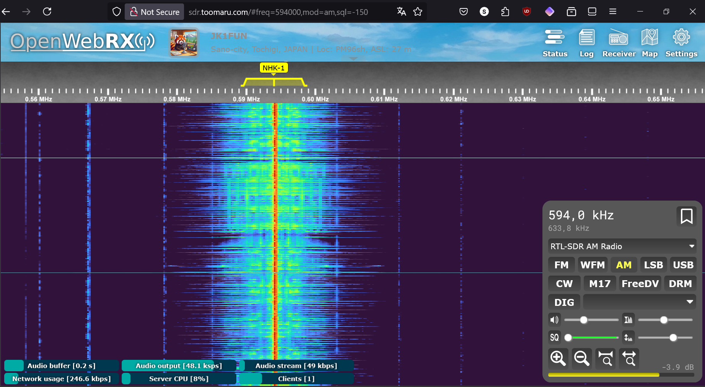
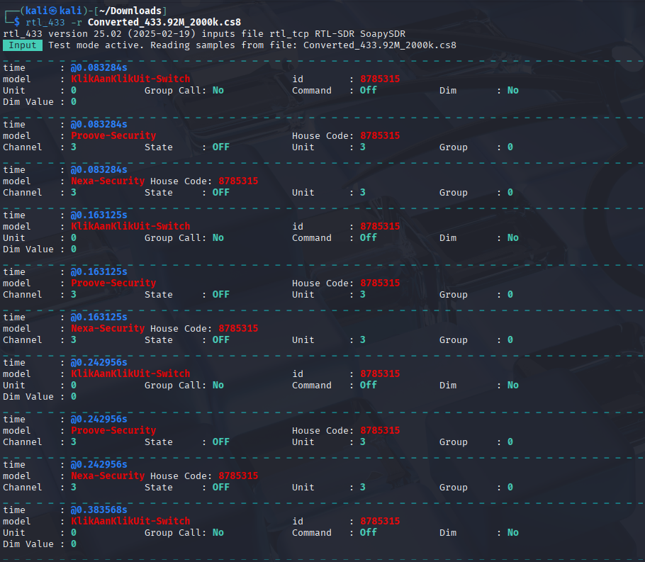

# Homework

Homework report for [h3 waves](https://terokarvinen.com/verkkoon-tunkeutuminen-ja-tiedustelu/#h3-aaltoja-harjaamassa) [[1]](#bibliography)

## Table of Contents

- [Introduction](#1-introduction)
- [x. Read and summarize](#x-read-and-summarize)
- [a. WebSDR](#a-websdr)
- [b. Automatic analysis](#b-automatic-analysis)
- [Bibliography](#bibliography)

## Introduction

This time I'll be looking at software radios and analyzing signals.

Unless otherwise stated, I'm using a Kali Linux virtual machine, with VirtualBox being the hypervisor.

I apologize in advance for the short length of this report and any other funny business, as I am battling the flu at the moment and struggling to use my brain effectively. 

## x. Read and summarize

Hubacek [[2]](#bibliography) uses Universal Radio Hacker SDR to record a radio transmission from a remote controller. In the spcetrum analyzer, he finds the specific frequency sent by the remote when pressing a button, and saves the transmission to a file. He then uses the interpreter to detect the bits encoded in the signal.

Cornelius [[3]](#bibliography) analyzes and decodes a signal from a weather station. First he uses the utility rtl_433 to automatically decode the signal, after which he does it manually using Universal Radio Hacker. In URH he uses the spectrum analyzer to find the correct frequency, and interpretation tab to save a small section of the transmission for decoding. He identifies the signal to use pulse distance modulation (PDM). Lastly he creates his own modulation decoding scheme, because URH does not decode PDM.

I tried searching for more information about PDM, but Googling "pulse distance modulation" only leads to results regarding Pulse-Width Modulation (PWM), Pulse-position modulation (PPM), and Pulse-Duration Modulation (PDM). This leads me to believe that Pulse-Distance Modulation is something non-standard. The author also mentiones in the beginning of the article that "the packets are ppm modulated" and talks about amplitude shift keying (ASK) [[3]](#bibliography). Therefore, I don't fully understand what the author is talking about in the latter half of the article.

## a. WebSDR

I searched "WebSDR Japan" on DuckDuckGo and found a software radio in Sano-City, Tochigi-prefecture, Japan, running OpenWebRX [[4]](#bibliography). NHK is the public broadcasting company in Japan, so I looked up the frequencies for NHK Radio 1 on Wikipedia [[5]](#bibliography). The closest to Tochigi in the list was Tokyo, which listed a frequency of 594 kHz. I looked around and got used to the interface, and finally picked "RTL-SDR AM Radio" from the list of frequencies, picked AM modulation, and tuned to 594 kHz. Then I turned up the volume and enjoyed some old-school Japanese pop-music. The sound quality wasn't very good, which I guess could be due to the radio hardware, it's placement, or any number of other reasons. I don't understand radios well enough to tell, however.

## b. Automatic analysis

I reattached the virtual network interface I had ripped out during the previous homework report [h2](../h2-favorite-color/h2-favorite-color.md), and updated everything in Kali Linux. After which I installed ``rtl_433`` with the command ``sudo apt install rtl-433``.

I downloaded the file provided in the exercise [[1]](#bibliography) and used the tips provided by Karvinen to open it with ``rtl_433 -r Converted_433.92M_2000k.cs8``.

There are several tags, with the most interesting being 'model'. There seems to be three distinct devices: KlikAanKlikUit-Switch, Proove-Security, and Nexa-Security. All of them also share a value of 8785315 in the 'id' and 'House Code' tags. All of them have a 'time' tag as well, which I guess is a simple timestamp of the recordings.

There are four distinct timestamps recorded. At each of them, all three devices are present simultaneously. Maybe they are modules in a single device?

Other tags like 'Command', 'Dim', and 'Dim Value' suggest that it might be a remote switch for dimmable lights. I search 'KlikAanKlikUit-Switch' on DuckDuckGo and find out that it is indeed part of a smart-home lighting solution of some kind [[6]](#bibliography)

## c. Too complex 16

## Bibliography
