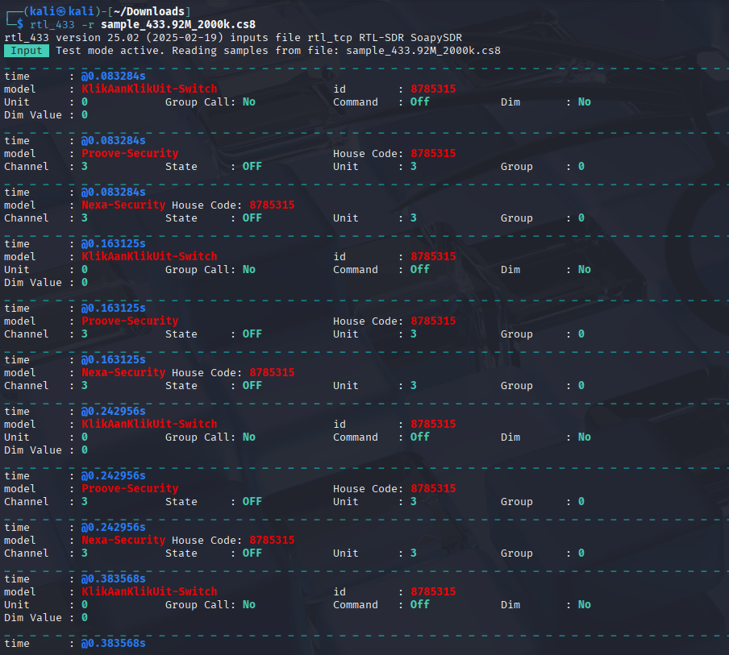
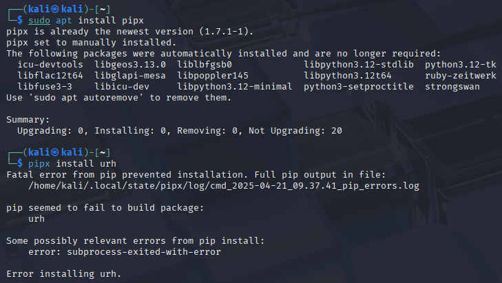
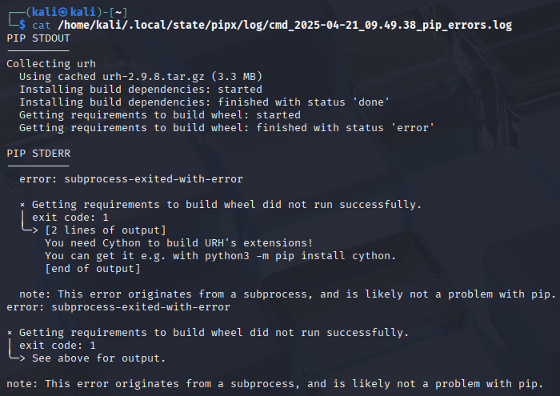
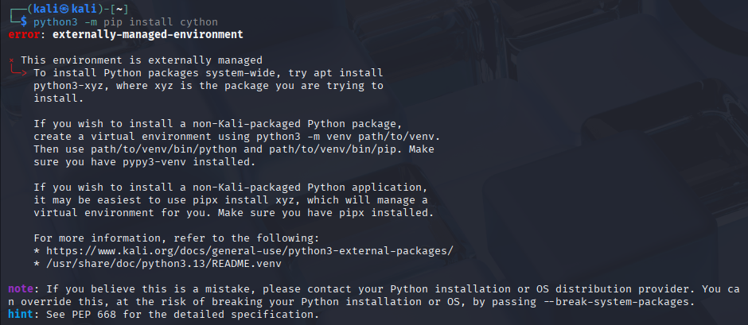
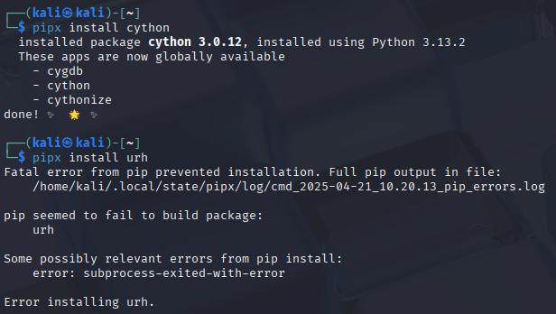
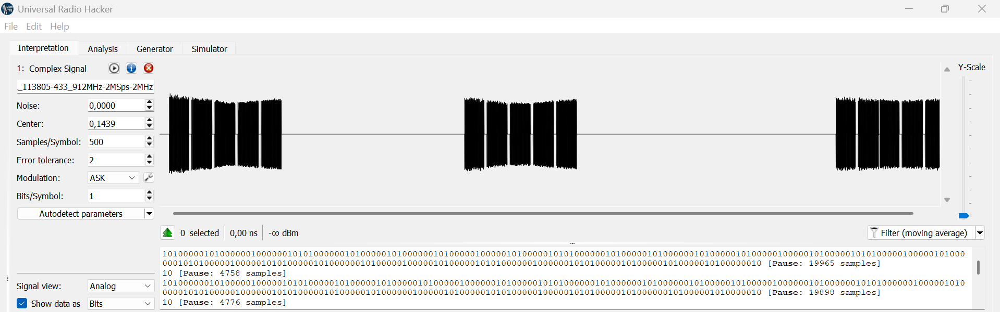
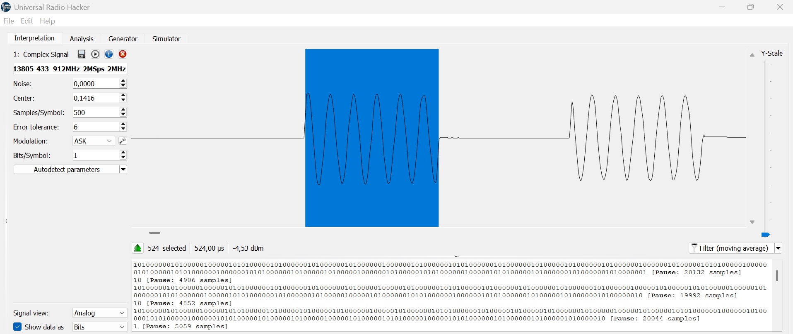
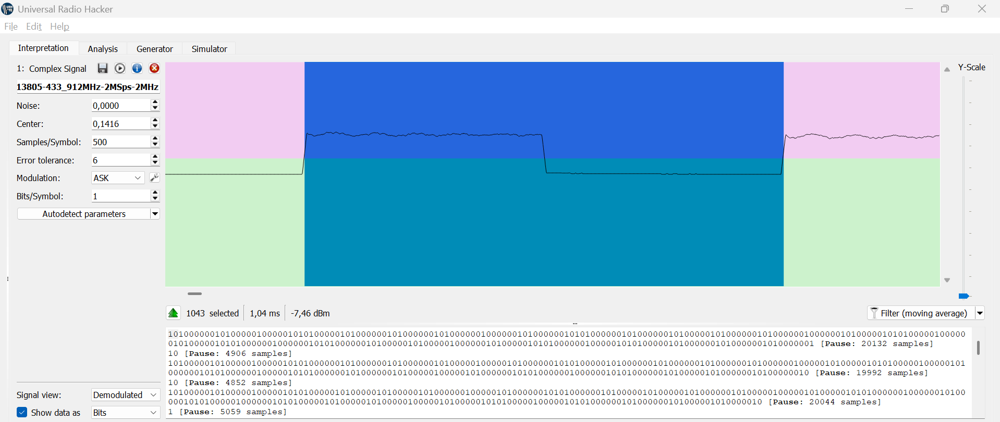

# Homework

Homework report for [h3 waves](https://terokarvinen.com/verkkoon-tunkeutuminen-ja-tiedustelu/#h3-aaltoja-harjaamassa) [[1]](#bibliography)

## Table of Contents

- [Introduction](#1-introduction)
- [x. Read and summarize](#x-read-and-summarize)
- [a. WebSDR](#a-websdr)
- [b. Automatic analysis](#b-automatic-analysis)
- [c. Too complex 16](#c-too-complex-16)
- [d. Ultimate](#d-ultimate)
- [e. Overview](#e-overview)
- [f. Bits](#f-bits)
- [Bibliography](#bibliography)

## Introduction

This time I'll be looking at software radios and analyzing signals.

Unless otherwise stated, I'm using a Kali Linux virtual machine, with VirtualBox being the hypervisor.

I apologize in advance for the short length of this report and any other funny business, as I am battling the flu at the moment and struggling to use my brain effectively. I've skipped all optional exercises for the same reason.

## x. Read and summarize

Hubacek [[2]](#bibliography) uses Universal Radio Hacker SDR to record a radio transmission from a remote controller. In the spcetrum analyzer, he finds the specific frequency sent by the remote when pressing a button, and saves the transmission to a file. He then uses the interpreter to detect the bits encoded in the signal.

Cornelius [[3]](#bibliography) analyzes and decodes a signal from a weather station. First he uses the utility rtl_433 to automatically decode the signal, after which he does it manually using Universal Radio Hacker. In URH he uses the spectrum analyzer to find the correct frequency, and interpretation tab to save a small section of the transmission for decoding. He identifies the signal to use pulse distance modulation (PDM). Lastly he creates his own modulation decoding scheme, because URH does not decode PDM.

I tried searching for more information about PDM, but Googling "pulse distance modulation" only leads to results regarding Pulse-Width Modulation (PWM), Pulse-position modulation (PPM), and Pulse-Duration Modulation (PDM). This leads me to believe that Pulse-Distance Modulation is something non-standard. The author also mentiones in the beginning of the article that "the packets are ppm modulated" and talks about amplitude shift keying (ASK) [[3]](#bibliography). Therefore, I don't fully understand what the author is talking about in the latter half of the article.

## a. WebSDR

I searched "WebSDR Japan" on DuckDuckGo and found a software radio in Sano-City, Tochigi-prefecture, Japan, running OpenWebRX [[4]](#bibliography). NHK is the public broadcasting company in Japan, so I looked up the frequencies for NHK Radio 1 on Wikipedia [[5]](#bibliography). The closest to Tochigi in the list was Tokyo, which listed a frequency of 594 kHz. I looked around and got used to the interface, and finally picked "RTL-SDR AM Radio" from the list of frequencies, picked AM modulation, and tuned to 594 kHz. Then I turned up the volume and enjoyed some old-school Japanese pop-music. The sound quality wasn't very good, which I guess could be due to the radio hardware, it's placement, or any number of other reasons. I don't understand radios well enough to tell, however.

## b. Automatic analysis

I reattached the virtual network interface I had ripped out during the previous homework report [h2](../h2-favorite-color/h2-favorite-color.md), and updated everything in Kali Linux. After which I installed ``rtl_433`` with the command ``sudo apt install rtl-433``.

I downloaded the file provided in the exercise [[1]](#bibliography) and used the tips provided by Karvinen to open it with ``rtl_433 -r Converted_433.92M_2000k.cs8``.

There are several tags, with the most interesting being 'model'. There seems to be three distinct devices: KlikAanKlikUit-Switch, Proove-Security, and Nexa-Security. All of them also share a value of 8785315 in the 'id' and 'House Code' tags. All of them have a 'time' tag as well, which I guess is a simple timestamp of the recordings.

There are four distinct timestamps recorded. At each of them, all three devices are present simultaneously. Maybe they are modules in a single device?

Other tags like 'Command', 'Dim', and 'Dim Value' suggest that it might be a remote switch for dimmable lights. I search 'KlikAanKlikUit-Switch' on DuckDuckGo and find out that it is indeed part of a smart-home lighting solution of some kind [[6]](#bibliography).

## c. Too complex 16

I once again downloaded the provided sample file in the exercise [[1]](#bibliography). The file was called ``Recorded-HackRF-20250411_183354-433_92MHz-2MSps-2MHz.complex16s``, and not compatible with rtl_433. According to Tero's tips, changing the format to a compatible one should be as simple as renaming it. 

In the tips section [[1]](#bibliography), there was the following example of a renamed file: ``rtl_433 -r foo_433.92M_1000k.cs8``. Therefore I tried changing the sample file's name to ``sample_433.92M_1000k.cs8``, but opening it with rtl_433 showed nothing. According to Karvinen, the file name has to have the correct 'center frequency' and 'sample rate'. Given how the sample's original file name has '2MHz' in it, I tried putting that in as the sample rate and changed the name to ``sample_433.92M_2000k.cs8``. After that, I tried opening it with the command ``rtl_433 -r sample_433.92M_2000k.cs8``. This time it worked!

Analyzing the output, it looks identical to the output in the previous exercise.

## d. Ultimate

I tried installing urh according to Tero's instructions [[1]](#bibliography), but ran in to the following error when running the command ``pipx install urh``.

I looked at the error logs to see if there's any more info on the problem.

It says I need Cython. So I followed the instruction and ran the command ``python3 -m pip install cython``.

More errors. The second to last paragraph suggests installing the package with ``pipx``, so I do with ``pipx install cython``.

Cython installed, I tried installing URH again with ``pipx install urh``, but alas it did not work this time either.

The error logs keep pointing to the same problem of Cython not existing.

I tried installing Cython3 with the apt package-manager, but that didn't fix the problem either.

Finally, I decided to just install URH (from the project's GitHub [[7]](#bibliography)) on my host Windows machine in order to continue with the exercises.

## e. Overview

I downloaded the provided sample in the exercise ``1-on-on-on-HackRF-20250412_113805-433_912MHz-2MSps-2MHz.complex16s`` [[1]](#bibliography) and opened it with URH.

Selecting the whole signal shows that it's 5.42s long. Looking at the file name, I conclude the center frequency to be 433.912 MHz. According to the timestamp, the signal was recorded on 2025-04-12 at 11:38:05.

The signal shows three button presses, each containing five distinct sections separated by pauses.

## f. Bits

Like in Hubacek's video [[2]](#bibliography) I used 'autodetect parameters', and it seems to have successfully recognized the modulation as ASK, and the length of the bits. One bit is approximately 500 microseconds long, which is also indicated in the 'Samples/Symbol' field. 

Looking at the demodulated view, the two bits look distinct in the signal.

## Bibliography

[1]
T. Karvinen, “Verkkoon tunkeutuminen ja tiedustelu - Network Attacks and Reconnaissance,” Terokarvinen.com, 2025. https://terokarvinen.com/verkkoon-tunkeutuminen-ja-tiedustelu/#h3-aaltoja-harjaamassa (accessed Apr. 16, 2025).

[2]
M. Hubacek, “Universal Radio Hacker SDR Tutorial on 433 MHz radio plugs,” YouTube, Jan. 18, 2019. https://www.youtube.com/watch?v=sbqMqb6FVMY (accessed Apr. 16, 2025).

[3]
Cornelius, “Decode 433.92 MHz weather station data,” One Transistor, Jan. 04, 2022. https://www.onetransistor.eu/2022/01/decode-433mhz-ask-signal.html (accessed Apr. 16, 2025).

[4]
J. Ketterl, “OpenWebRX | Open Source SDR Web App for Everyone!,” Toomaru.com, 2025. http://sdr.toomaru.com/#freq=594000 (accessed Apr. 16, 2025).

[5]
Wikipedia Contributors, “NHK Radio 1,” Wikipedia, Dec. 24, 2024. https://en.wikipedia.org/wiki/NHK_Radio_1 (accessed Apr. 16, 2025).

[6]
Athom B.V., “KlikAanKlikUit,” Homey.app, 2025. https://homey.app/en-us/works-with-homey/klikaanklikuit/ (accessed Apr. 16, 2025).

[7]
J. Pohl, “jopohl/urh,” GitHub, May 24, 2022. https://github.com/jopohl/urh (accessed Apr. 22, 2025).