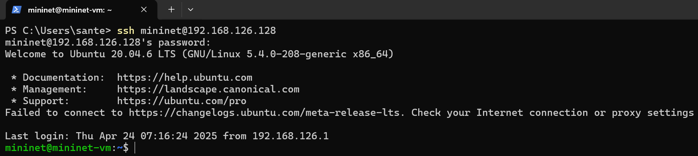
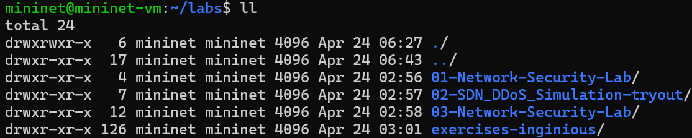
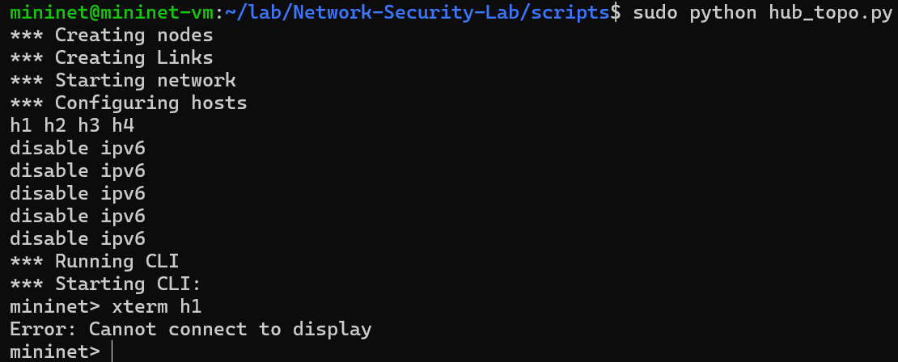

# Homework

Homework report for [h5 lab](https://terokarvinen.com/verkkoon-tunkeutuminen-ja-tiedustelu/) [[1]](#bibliography)

Work in progress...

## Table of Contents

- [Introduction](#1-introduction)
- [Bibliography](#bibliography)

## Introduction

## x. Classroom exercise

Lari Iso-Anttila provided a virtual machine file on the course's Moodle page, which contains the lab environment, as well as scripts etc. used in the classroom exercises.

I started by installing VMware Workstation Pro 17, and imported the provided virtual machine. Once the VM booted, I used ``ip a`` to get an IP-address to connect to via SSH. However, the virtual network adapter didn't work properly, and there was no address. I shutdown the VM and changed the VM's network interface from 'bridged adapter' to 'host-only adapter'. Once rebooted, I got a local IP-address of 192.168.126.128 on eth0. I then used PowerShell on my host Windows 11 machine to connect to the VM (``ssh mininet@192.168.126.128``).

Apparently the exercises included in the VM were outdated, so I downloaded the updated ones from the Moodle page to my host machine, and then used ``scp .\labs.tar.gz mininet@192.168.126.128:/home/mininet`` to copy them to the VM's user directory. After that I extracted the archive to a separate directory under the user directory with ``tar -xvf ../labs.tar.gz``.

In the '01-Network-Security-Lab' exercise, I followed the instructions and ran the Python script in ``/home/mininet/lab/Network-Security-Lab/scripts/`` with ``sudo python hub_topo.py``. This established the Mininet network and created the nodes h1, h2, h3, and h4. Lari instructed to use Xterm (eg.``xterm h1``) in order to get separate terminal windows for each node. Without Xterm, the user can't see commands being run on each node. However, Xterm didn't work as intended for me, other students, nor Lari, for some inexplicable reasons. Lari said he would look in to the issue and update the exercise once it's been resolved. As of now (2024-04-24 14:36) I cannot continue the provided exercises.

## Bibliography
